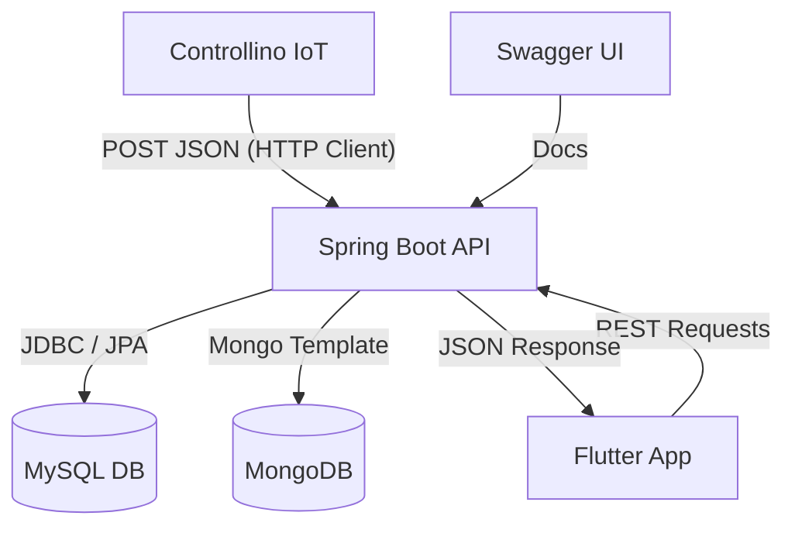

# MèlticGmao v0.8 (Alpha): Ecosistema Inteligente de Mantenimiento Industrial

## 🏗️ v0.8: Estado de Desarrollo e Integración (80%)
*Actualmente el proyecto se encuentra en una fase avanzada de integración (80%), con el núcleo de telemetría y gestión de OTs plenamente operativo, pendiente de validación final en entorno real.*

## 🚀 Visión General de Industria 4.0
MèlticGmao es una solución integral diseñada para la digitalización del mantenimiento en entornos industriales. Combina hardware IoT embebido (Controllino/Arduino), una arquitectura de backend robusta y una interfaz móvil multiplataforma (Flutter) para ofrecer trazabilidad total, monitorización en tiempo real y gestión eficiente de activos.

## 🏗️ Arquitectura Híbrida Políglota
El sistema implementa una persistencia dual estratégicamente diseñada para maximizar la eficiencia según el tipo de dato:

*   **MySQL (Relacional):** Gestión del núcleo de negocio. Usuarios, Roles, Inventario de Máquinas y Ciclo de vida de Órdenes de Trabajo (OT). Garantiza integridad referencial y consistencia ACID.
*   **MongoDB (NoSQL/Series Temporales):** Almacenamiento masivo de telemetría IoT. Captura temperatura, humedad y eventos de motor a alta frecuencia, permitiendo análisis histórico sin penalizar el rendimiento del sistema transaccional.

## 📊 Diagrama de Flujo de Datos

## 🛠️ Guía de Instalación y Despliegue

### 1. Backend (Spring Boot)
1.  Configurar las credenciales en `src/main/resources/application.properties`.
2.  Ejecutar `./mvnw spring-boot:run` (o `mvnw.cmd` en Windows).
3.  Acceder a la documentación interactiva en: `http://localhost:8080/swagger-ui/index.html`.

### 2. Firmware (Controllino)
1.  Abrir `sketch_feb14a.ino` en Arduino IDE.
2.  **IMPORTANTE:** Asegurarse de que la variable `server` coincida con la IP local del equipo que ejecuta el backend.
3.  Cargar el firmware y monitorizar vía Serial (9600 baudios).

### 3. Frontend (Flutter)
1.  Navegar a la carpeta del proyecto Flutter.
2.  Ejecutar `flutter pub get`.
3.  Lanzar la aplicación con `flutter run`.

## 📜 Tabla de Trazabilidad de Requisitos

| ID | Requisito | Endpoint Backend | Pantalla App | Componente Hardware |
| :--- | :--- | :--- | :--- | :--- |
| **R01** | Autenticación Segura | `POST /api/auth/login` | `LoginScreen` | - |
| **R02** | Login por Proximidad | `POST /api/auth/rfid-login` | `LoginScreen` | MFRC522 (RFID) |
| **R03** | Telemetría IoT | `POST /api/plc/data` | `MaquinaDetail` | DHT11 (Temp/Hum) |
| **R04** | Historial de Sensores | `GET /api/plc/maquina/{id}` | `TelemetriaChart` | MongoDB |
| **R05** | Gestión de OTs | `GET /api/ordenes` | `OrdenesScreen` | MySQL |
| **R06** | Firma Digital | `PATCH /api/ordenes/{id}/firmas` | `SignaturePad` | Mobile UI |
| **R07** | Filtrado Avanzado | `GET /api/ordenes/search` | `FiltrosDialog` | Criteria API (JPA) |
| **R08** | Reporte PDF | `GET /api/ordenes/{id}/pdf` | `PdfViewer` | iText / Base64 |
| **R09** | Gemelo Digital | `PUT /api/maquinas/{id}` | `ConfigDialog` | Configuración Límites |

## 🛠️ Avances Técnicos y Estabilidad (v0.8)

### 🌐 Configuración de Red
*   **IP PLC (Ethernet):** `192.168.1.11` (Configurado en `application.properties`).
*   **Hotspot Windows:** El PC emite una red WiFi para el móvil (IP Puerta de enlace: `192.168.137.1`).
*   **Conectividad App:** La aplicación móvil apunta a la IP del Hotspot (`http://192.168.137.1:8080`).

### 🛡️ Mecanismos de Pruebas y Simulación
*   **Simulación RFID:** Gesto de **doble toque** sobre el icono NFC en `LoginScreen`.
*   **Failsafe:** Lectura simulada de tarjeta maestra (`40:91:F3:61`) para validación de flujos sin hardware.

### 📱 Optimización de Interfaz
*   **Diseño Responsivo:** Pantallas adaptadas 100% a visualización vertical en smartphones.
*   **Detalle de Máquina:** Nuevo layout 2x2 para gestión de umbrales.
*   **UX:** Gestión de foco y teclado optimizada en paneles de firma.

### ⚙️ Mejoras de Sistema
*   **Resiliencia de Red:** Polling a 15s y timeouts de 5s para evitar bloqueos del PLC.

---
© 2026 MèlticGmao - Innovación en Mantenimiento Industrial (En desarrollo).
