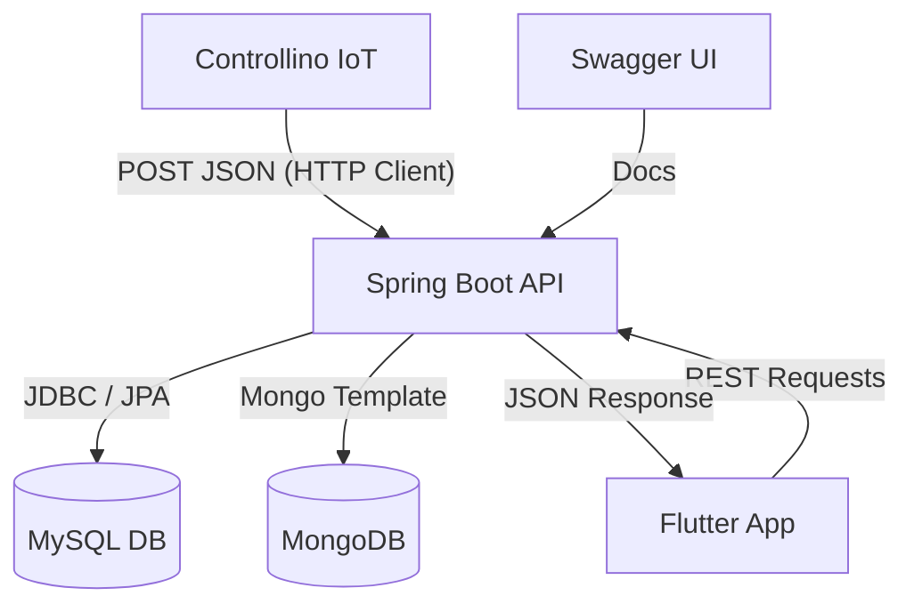

# MèlticGmao 4.0: Ecosistema Inteligente de Mantenimiento Industrial

## 🚀 Visión General de Industria 4.0
MèlticGmao 4.0 es una solución integral diseñada para la digitalización del mantenimiento en entornos industriales. Combina hardware IoT embebido (Controllino/Arduino), una arquitectura de backend robusta y una interfaz móvil multiplataforma (Flutter) para ofrecer trazabilidad total, monitorización en tiempo real y gestión eficiente de activos.

## 🏗️ Arquitectura Híbrida Políglota
El sistema implementa una persistencia dual estratégicamente diseñada para maximizar la eficiencia según el tipo de dato:

*   **MySQL (Relacional):** Gestión del núcleo de negocio. Usuarios, Roles, Inventario de Máquinas y Ciclo de vida de Órdenes de Trabajo (OT). Garantiza integridad referencial y consistencia ACID.
*   **MongoDB (NoSQL/Series Temporales):** Almacenamiento masivo de telemetría IoT. Captura temperatura, humedad y eventos de motor a alta frecuencia, permitiendo análisis histórico sin penalizar el rendimiento del sistema transaccional.

## 📊 Diagrama de Flujo de Datos

## 🛠️ Guía de Instalación y Despliegue

### 1. Backend (Spring Boot)
1.  Configurar las credenciales en `src/main/resources/application.properties`.
2.  Ejecutar `./mvnw spring-boot:run` (o `mvnw.cmd` en Windows).
3.  Acceder a la documentación interactiva en: `http://localhost:8080/swagger-ui/index.html`.

### 2. Firmware (Controllino)
1.  Abrir `sketch_feb14a.ino` en Arduino IDE.
2.  **IMPORTANTE:** Asegurarse de que la variable `server` coincida con la IP local del equipo que ejecuta el backend.
3.  Cargar el firmware y monitorizar vía Serial (9600 baudios).

### 3. Frontend (Flutter)
1.  Navegar a la carpeta del proyecto Flutter.
2.  Ejecutar `flutter pub get`.
3.  Lanzar la aplicación con `flutter run`.

## 📜 Tabla de Trazabilidad de Requisitos

| ID | Requisito | Endpoint Backend | Pantalla App | Componente Hardware |
| :--- | :--- | :--- | :--- | :--- |
| **R01** | Autenticación Segura | `POST /api/auth/login` | `LoginScreen` | - |
| **R02** | Login por Proximidad | `POST /api/auth/rfid-login` | `LoginScreen` | MFRC522 (RFID) |
| **R03** | Telemetría IoT | `POST /api/plc/data` | `MaquinaDetail` | DHT11 (Temp/Hum) |
| **R04** | Historial de Sensores | `GET /api/plc/maquina/{id}` | `TelemetriaChart` | MongoDB |
| **R05** | Gestión de OTs | `GET /api/ordenes` | `OrdenesScreen` | MySQL |
| **R06** | Firma Digital | `PATCH /api/ordenes/{id}/firmas` | `SignaturePad` | Mobile UI |
| **R07** | Filtrado Avanzado | `GET /api/ordenes/search` | `FiltrosDialog` | Criteria API (JPA) |
| **R08** | Reporte PDF | `GET /api/ordenes/{id}/pdf` | `PdfViewer` | iText / Base64 |
| **R09** | Gemelo Digital | `PUT /api/maquinas/{id}` | `ConfigDialog` | Configuración Límites |

## 🚀 Mejoras Recientes

### 🔧 Backend & Estabilidad
*   **Fix de Compilación Maven:** Corregido error en `MantenimientoService` extendiendo `JpaSpecificationExecutor` en los repositorios para soportar consultas dinámicas (Criteria API).
*   **Hardening de Seguridad RFID:** Implementado filtrado de ruido en la telemetría para evitar autenticaciones accidentales por interferencias en el firmware.
*   **Motor de Búsqueda:** Implementado sistema de filtrado multi-parámetro (técnico, máquina, estado, prioridad y fechas) para la gestión eficiente de OTs.
*   **Generación de Reportes:** Integrado sistema de exportación a PDF "al vuelo" con los datos finales de la intervención, incluyendo firmas y fotos.

### 📱 Frontend (Flutter)
*   **UI de Gemelo Digital:** Rediseño de los diálogos de configuración, sustituyendo sliders por inputs numéricos de precisión para el ajuste de umbrales térmicos y de humedad.
*   **Experiencia de Filtros:** Implementado diálogo de filtros avanzados en la pantalla de Órdenes de Trabajo para mejorar la usabilidad en entornos con alta densidad de datos.
*   **Integración de PDF:** Añadido soporte para previsualización y descarga de informes técnicos directamente desde la aplicación móvil.

---

