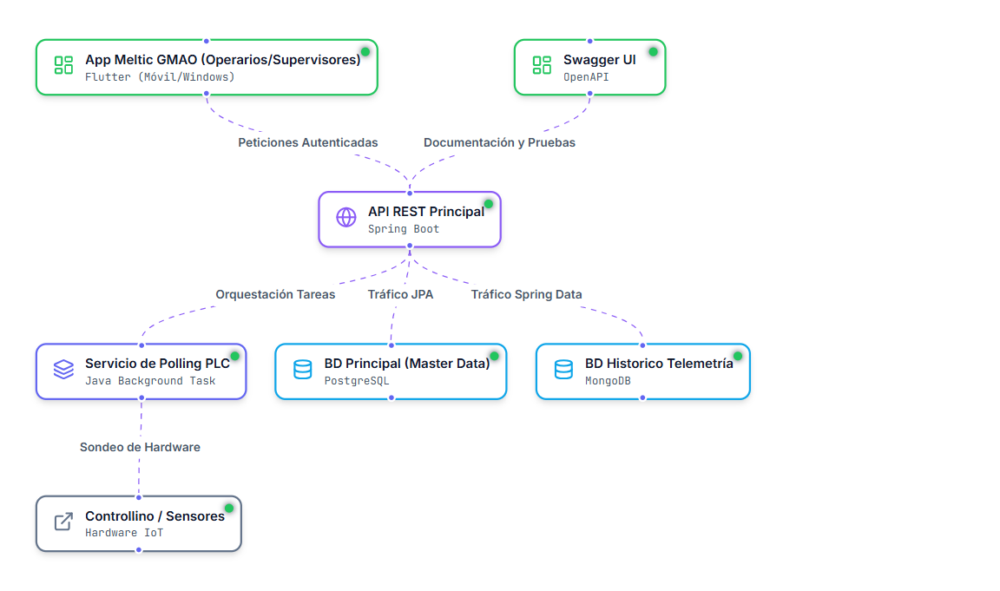

<p align="center">
  
</p>

# 🏭 Mèltic GMAO: Mantenimiento Industrial IoT (Industria 4.0)

> **Trabajo de Fin de Grado (DAM / SMR)**
>
> Sistema de Gestión de Mantenimiento Asistido por Ordenador (GMAO) integrado con telemetría en tiempo real y Gemelo Digital mediante hardware industrial.

---

## 📖 Descripción del Proyecto

**Mèltic GMAO** nace para resolver el problema del mantenimiento reactivo ineficiente y la gestión documental arcaica en la logística e industria manufacturera. 

La plataforma une dos mundos tradicionalmente separados: **Las Tecnologías de Operación (OT)** en planta baja, y las **Tecnologías de la Información (IT)** corporativas. A través de un PLC Industrial, el ecosistema captura hasta 15 variables críticas de telemetría (temperatura, presión, vibración axial, intensidad de fase) y sincroniza datos reales hacia una aplicación reactiva en manos del técnico u operario.

### 🌟 Funcionalidades Principales
*   **📡 Telemetría en Tiempo Real (Digital Twin):** Visualización interactiva de gráficas mediante ingesta masiva (Buffer de 200 registros a 15s) con corrección de latencia (Drift Correction).
*   **🔐 Autenticación IoT Biométrica:** Lectores RFID en máquina operan por interrupción. Los operarios fichan su intervención simplemente acercando su tarjeta física al hardware.
*   **📑 Paperless Industrial (Zero-Impact):** Cierre de Órdenes de Trabajo desde el móvil firmando manualmente en pantalla (Vector Rendering) y tomando capturas con la cámara. El sistema auto-genera un documento probatorio técnico en formato PDF oficial inviolable.
*   **⚙️ Failsafe & Debouncing Integrado:** El software filtra ruidos electromagnéticos del hardware físico implementando un buffer de seguridad para preservar los datos analógicos reales.

---

## 🛠️ Arquitectura Tecnológica & Stack

El sistema posee una topología de red aislada en dos VLANs y aplica **Persistencia Políglota** (*Polyglot Persistence*) según la demanda de los datos procesados.

### 🔌 1. Capa de Adquisición (Hardware / IoT)
*   **Microcontrolador:** PLC Industrial **Controllino** (Plataforma C++ Arduino Mega 2560).
*   **Interacciones:** Sensores de simulación multivariable (Temperatura, RPM, Caudal), Lector RFID RC522 protocolo SPI.
*   **Comunicaciones:** Red Industrial Activa emitiendo payload HTTP Polling.

### 🧠 2. Capa de Lógica y Microservicios (Backend)
*   **Framework Core:** Java **Spring Boot 3** bajo persistencia de JPA/Hibernate.
*   **Seguridad y Sesión:** Tokens auto-firmados Stateless **(JWT)**. Integración dual con RFID.
*   **Documentación de Contrato:** API RESTful trazada permanentemente mediante Swagger UI / OpenAPI 2.0.

### 💾 3. Capa de Persistencia Políglota
*   **MySQL (SQL Transactional):** Responsable estricto de la coherencia ACID para la lógica de Usuarios, Entidades de Activos y control de estados (Órdenes de Trabajo).
*   **MongoDB (NoSQL Time-Series):** Repositorio asíncrono para ingesta del Big Data de telemetría. Almacena objetos BSON brutos permitiendo escalabilidad en series de métricas sin entorpecer a la pasarela SQL de negocio.

### 📱 4. Capa Cliente (Frontend Mobile)
*   **Tecnología Central:** **Flutter Framework** asíncrono multiplataforma (Dart).
*   **Requerimientos Operativos:** Diseño de Alto Contraste (Industrial Readability), `pdf_generator` interno.

---

## 🚀 Despliegue con Docker (Recomendado)

Para una instalación limpia y rápida que incluya todas las dependencias (MySQL, MongoDB, Backend y Frontend Web), usa Docker:

1. **Levantar el ecosistema completo**:
   ```powershell
   docker compose up --build -d
   ```
2. **Acceso a las plataformas**:
   - **Frontend Web**: `http://localhost:8081`
   - **Backend API (Swagger)**: `http://localhost:8080/swagger-ui.html`
3. **Gestión de contenedores**:
   - Ver logs: `docker logs meltic-backend -f`
   - Parar sistema: `docker compose down`

---

## 🔌 Hardware Meltic 4.0 (Controllino)

El firmware incluido en `sketch_feb14a/` ha sido optimizado para entornos industriales reales:
- **Aislamiento SPI**: Gestión estricta de pines `Chip Select` para evitar conflictos entre el módulo Ethernet y el lector RFID RC522.
- **Protocolo Swipe & Go**: Detección asíncrona de tarjetas con limpieza automática de buffer tras 2.5s.
- **Filtrado de Ruido DHT11**: Implementación de lógica de muestreo cada 30s con eliminación de lecturas espurias (NaN/0.0).

---

## 🛡️ Atajos de Escena & Seguridad (Demo-Safe)

- **Login Maestro**: Tocar el logo de Meltic en la pantalla inicial activa una simulación de lectura RFID Admin.
- **Roles Securizados**: 
    - **Admin/Jefe**: Acceso total a "Gestión de Personal".
    - **Técnico**: Acceso restringido al Dashboard y Órdenes de Trabajo (Navegación protegida por Guard).
- **Simulación RFID**: Toque largo en el icono de sensor en los formularios para forzar la lectura del TAG detectado.

---


> **Autor:** Santiago Moratalla  
> **Fecha Presentación:** *Primavera 2026*  
> **Licencia:** Material Registrado para uso exclusivamente académico y demostrativo.
